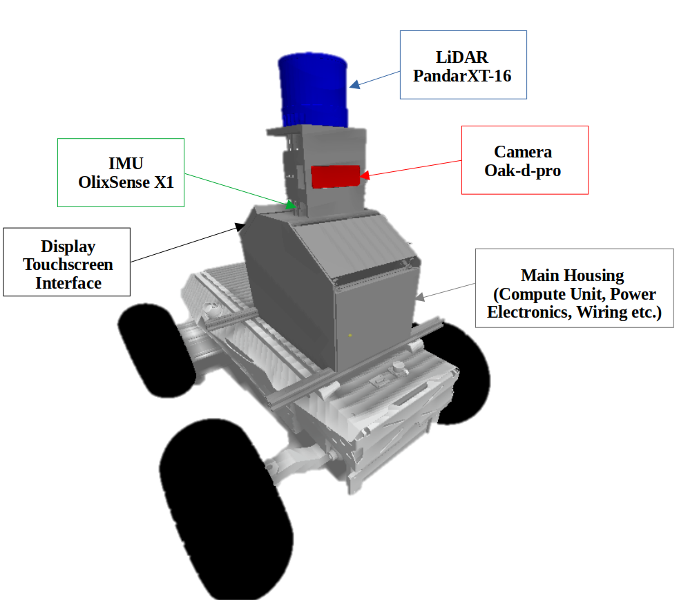

<p align="center">
  <h1 align="center">Enhancing Stereo Matching with Multi-Scale Selective Attention Aggregation</h1>
  <p align="center">
    Mahmoud Tahmasebi* (mahmoud.tahmasebi@research.atu.ie)
  </p>
  <h3 align="center"><a href="">Paper</a>
  <div align="center"></div>
</p>
<p align="center">
  <a href="">
    
  </a>
</p>


# Performance on KITTI raw dataset
This video was recorded during a straight-line navigation test on the Hunter V2 Robot.
For more details, please visit the project repository: [https://github.com/M2219/ACNMR](https://github.com/M2219/ACNMR)

You may also be interested in the following related repository, which is a fork of OpenVINS:
[https://github.com/M2219/open_vins](https://github.com/M2219/open_vins)
This fork modifies the original code to accept disparity maps for finding keypoint correspondences in images and includes configuration files for the OAK-D Pro camera.
<p align="center">
  
  
</p>

<p align="center">
  
</p>

# SOTA results.

| Method | KITTI 2012 <br> (3-noc) | KITTI 2012 <br> (3-all) | KITTI 2015 <br> (D1-bg) | KITTI 2015 <br> (D1-fg) | KITTI 2015 <br> (D1-all) |Runtime <br> (ms)|
|:-:|:-:|:-:|:-:|:-:|:-:|:-:|
| CFNet | 1.23 % | 1.58 % | 1.54 % | 3.56 % | 1.94 % | 29 |
| IGEV-Stereo | 1.55 % | 1.93 % | 1.79 % | 3.82 % | 2.13 % | 33 |
| ACVNet | 1.62 % | 2.03 % | 1.81 % | 4.09 % | 2.19 % | 35 |
| LEAStereo | 1.62 % | 2.03 % | 1.81 % | 4.09 % | 2.19 % | 35 |
| EdgeStereo-V2 | 1.41 % | 1.89 % | 1.74 % | **3.20 %** | 1.98 % | 54 |
| CREStereo | 1.45 % | 1.85 % | 1.70 % | 3.53 % | 2.01 % | 45 |
| SegStereo | 4.11 % | 4.65 % | 2.21 % | 6.16 % | 4.43 % | 60 |
| SSPCVNet | 1.91 % | 2.42 % | 1.99 % | 5.39 % | 2.55 % | 62 |
| CSPN | 1.64 % | 2.11 % | 1.91 % | 4.47 % | 2.33 % | 80 |
| **StereoSA**| **1.30 %** | **1.67 %** | **1.60 %** | 3.33 % | **1.89 %** | 67 |

The results on SceneFlow dataset.
| Method (Real-Time) | EPE [px] | Runtime (ms) | GPU |
|:-:|:-:|:-:|:-:|
| DCVSMNet | 0.60 | 67 | RTX 3080 |
| ACVNet | 0.48 | 200 | RTX 3090 |
| Selective-IGEV | 0.44 | 240 | RTX 3090 |
| IGEV++ | 0.43 | 280 | RTX 3080 |
| DLNR | 0.47 | 297 | A100 |
| MoCha-Stereo | **0.41** | 340 | 2 x A6000 |
| DiffuVolume | 0.46 | 360 | RTX 3090 |
| IGEV-Stereo | 0.47 | 370 | RTX 3090 |
| **StereoSA** | **0.41** | **64** | RTX 4070S |
# How to use

## Environment
* NVIDIA RTX 4070S
* Python 3.10
* Pytorch 2.0.0

## Install

### Create a virtual environment and activate it.

```
conda create -n StereoSA python=3.10
conda activate StereoSA
```
### Dependencies

```
conda install pytorch torchvision torchaudio cudatoolkit=11.8 -c pytorch -c nvidia
pip install opencv-python
pip install scikit-image
pip install tensorboard
pip install matplotlib 
pip install tqdm
pip install timm=1.0.11
```

## Data Preparation
* [SceneFlow Datasets](https://lmb.informatik.uni-freiburg.de/resources/datasets/SceneFlowDatasets.en.html)
* [KITTI 2012](http://www.cvlibs.net/datasets/kitti/eval_stereo_flow.php?benchmark=stereo)
* [KITTI 2015](http://www.cvlibs.net/datasets/kitti/eval_scene_flow.php?benchmark=stereo)
* [Middlebury](https://vision.middlebury.edu/stereo/submit3/)

## Train

Use the following command to train StereoSA on SceneFlow.
First training,
```
python train_sceneflow.py --logdir ./checkpoints/sceneflow/first/
```
Second training,
```
python train_sceneflow.py --logdir ./checkpoints/sceneflow/second/ --loadckpt ./checkpoints/sceneflow/first/checkpoint_000059.ckpt
```

Use the following command to finetune StereoSA on KITTI using the pretrained model on SceneFlow,
```
python train_kitti.py --logdir ./checkpoints/kitti/ --loadckpt ./checkpoints/sceneflow/second/checkpoint_000059.ckpt
```


## Evaluation on SceneFlow and KITTI

### Pretrained Model
* [StereoSA](https://drive.google.com/drive/folders/1wfyn3Wi_NIEc0uottSXt43mFUiraiB9Q?usp=drive_link)

Generate disparity images of KITTI test set,
```
python save_disp.py
```

# Citation

If you find this project helpful in your research, welcome to cite the paper.

```
```

# Acknowledgements

Thanks to open source works: [OpenVINS](https://github.com/rpng/open_vins).
